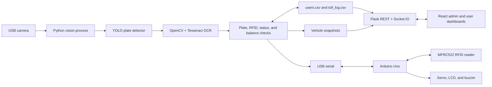
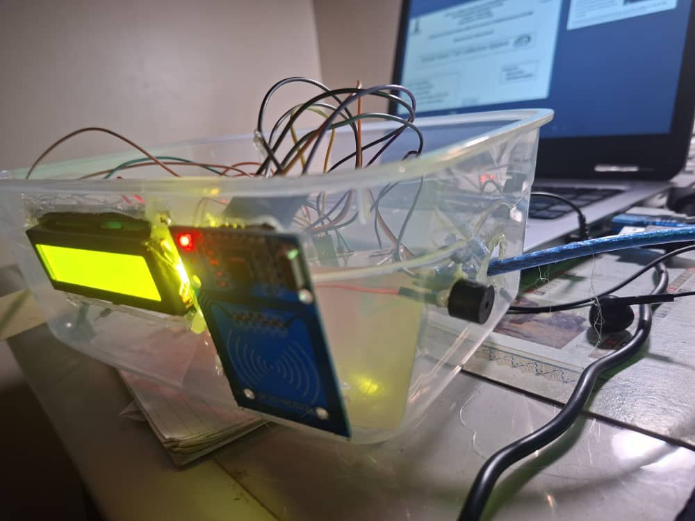
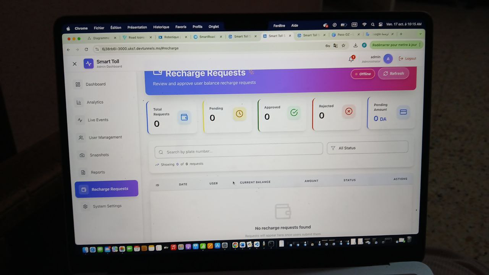
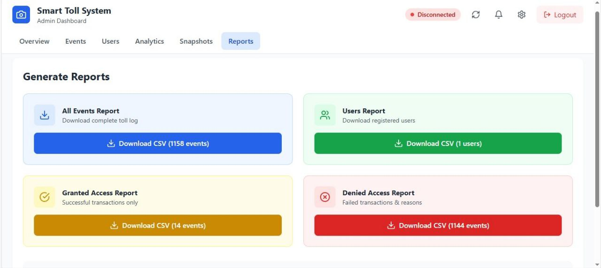

# DzToll – Multi-Lane Smart Tolling System

DzToll is an automated tolling prototype that combines camera-based license-plate recognition with RFID verification, account checks, gate hardware control, transaction logging, and web dashboards.

> The current source implements one configured lane (`Gate A`). The repository title reflects the broader project goal; multi-lane coordination is not yet implemented in the checked-in code.

## Overview

The prototype joins three working layers:

- A Python vision and transaction process detects a license plate, reads its text, validates the vehicle and RFID UID, and records the result.
- Arduino firmware handles the RFID reader, LCD, buzzer, and servo-operated barrier.
- A Flask/Socket.IO backend and React frontend provide admin and user views over CSV-backed records.

## Problem

Manual toll collection can introduce queues, repeated operator work, and inconsistent transaction records. This project explores a contactless workflow in which vehicle and RFID identifiers are checked before the barrier is opened.

## Solution

DzToll uses a custom YOLO model to locate a license plate in camera frames and Tesseract OCR to extract alphanumeric text. A registered plate must then present the matching RFID UID and have an active account with enough balance. The result is sent to the Arduino gate controller and written to the toll log.

## Key Features

- Camera capture with YOLO license-plate-region detection.
- OpenCV preprocessing and Tesseract OCR.
- Plate, RFID UID, account-status, and balance validation.
- Arduino serial protocol using `WAIT_RFID`, `OPEN`, and `DENY` commands.
- Servo, LCD, and buzzer feedback through the gate firmware.
- CSV-backed users and toll-event records.
- Vehicle snapshots and optional SMTP email notifications.
- Admin and user React dashboards.
- REST endpoints and Socket.IO updates from the Flask server.

## System Architecture



The vision process and Flask server are separate Python programs. They share CSV files and the snapshot directory in `backend/`.

## How It Works

1. OpenCV reads a camera frame and processes every configured frame interval.
2. The YOLO model returns candidate plate bounding boxes.
3. The selected crop is enhanced with grayscale conversion, CLAHE, bilateral filtering, adaptive thresholding, morphological opening, and resizing.
4. Tesseract returns sanitized uppercase alphanumeric plate text.
5. The plate is matched against `backend/users.csv`.
6. For a known plate, Python asks the Arduino to wait for an RFID tag.
7. The returned UID is compared with the registered UID, then active status and balance are checked.
8. An authorized account is charged the configured toll fee; Python sends `OPEN`. Other outcomes send `DENY`.
9. The event, balances, location, and snapshot filename are appended to `backend/toll_log.csv`.

## Hardware

Verified by the firmware, source, presentation, or prototype media:

- Arduino Uno
- MFRC522 RFID reader and RFID tag/card
- Servo motor for the barrier mechanism
- 16×2 I²C LCD
- Buzzer
- USB camera/webcam

Raspberry Pi integration is not present in the available source or configuration and is therefore not documented as an implemented platform.

## Software

| Layer | Verified software |
| --- | --- |
| Vision and control | Python, OpenCV, Ultralytics YOLO, PyTorch, Tesseract/pytesseract, pandas, pyserial |
| API and live updates | Flask, Flask-CORS, Flask-SocketIO, watchdog |
| Frontend | React 18, Axios, Socket.IO client, Tailwind CSS, Lucide React |
| Firmware | Arduino C/C++, MFRC522, LiquidCrystal_I2C, Servo, SPI, Wire |
| Storage | CSV files and JPEG snapshots |

The included model archive identifies a YOLOv8n base model with one `license_plate` class. Training data and evaluation logs are not included, so this repository makes no accuracy claim.

## Multi-Lane Operation

The current runtime has one camera index, one serial port, and one location value. It does not contain a multi-lane scheduler, per-lane process manager, or concurrent lane configuration. A multi-lane deployment would require isolated camera/Arduino configuration and coordinated event handling for each lane.

## RFID Workflow

The gate firmware listens at 9600 baud. After receiving `WAIT_RFID`, it reads an MFRC522 UID and returns it as `RFID=<UID>`. The Python process compares that value with the UID stored for the detected plate. It then returns `OPEN` or `DENY`; the firmware updates the LCD and buzzer, and opens the servo briefly only for granted access.

## Camera and Monitoring System

The camera loop uses a configurable camera index and capture size. Detected plates are annotated in the local OpenCV window, while transaction snapshots are saved under `backend/snapshots/`. The Flask server exposes recent events, analytics derived from the CSV files, and snapshot files to the dashboard.

## Installation

### Prerequisites

- Python and `pip`
- Node.js and npm
- Tesseract OCR
- Arduino IDE with `MFRC522`, `LiquidCrystal_I2C`, and `Servo` libraries
- The verified hardware listed above for the complete gate workflow

### Backend and vision dependencies

```bash
python -m venv .venv
source .venv/bin/activate
pip install -r backend/requirements.txt
cp backend/.env.example backend/.env
cp backend/users.example.csv backend/users.csv
```

On Windows, activate the environment with `.venv\Scripts\activate` and set `TESSERACT_CMD` and `ARDUINO_PORT` in `backend/.env` as needed.

### Frontend dependencies

```bash
cd frontend
npm install
cp .env.example .env
```

### Firmware

Upload `firmware/rfid_gate/rfid_gate.ino` to the Arduino Uno. `firmware/read_rfid/read_rfid.ino` is a separate UID-reading utility sketch.

## Configuration

Set real values only in ignored `.env` files. Do not commit them.

| File | Purpose |
| --- | --- |
| `backend/.env` | Login passwords, CORS/Flask options, camera, serial, OCR, lane, fee, timing, and optional email settings |
| `frontend/.env` | API, Socket.IO, snapshot base URL, admin identifier, and UI settings |
| `backend/settings.json` | Settings read and updated by the admin settings API |
| `backend/users.csv` | Local registered-vehicle records; create from the header-only example |

Email notifications remain disabled unless `ALERT_EMAIL`, `SMTP_USER`, and `SMTP_APP_PWD` are all configured.

## Usage

Start the API server from the repository root:

```bash
python backend/flask_server.py
```

Start the React dashboard in another terminal:

```bash
cd frontend
npm start
```

With the trained model, Tesseract, camera, and optional Arduino connected, start the toll process from the repository root:

```bash
python backend/smart_toll_system.py
```

Press `q` in the OpenCV window to stop the camera loop.

## Repository Structure

```text
.
├── assets/images/              # Selected public documentation images
├── backend/                   # Vision process, Flask server, tools, and examples
├── firmware/                  # Gate firmware and RFID UID reader sketch
├── frontend/                  # React admin/user dashboard
├── models/license_plate/      # Selected YOLO runtime weight and notes
├── .gitignore
└── README.md
```

## Screenshots

### Hardware prototype



### Admin recharge requests



### Admin reports



## Demo

A 16-second prototype video was verified during the repository audit. It shows a plate presented to the camera and the connected LCD/RFID hardware sequence. The raw video is intentionally excluded from Git; publish it as a GitHub Release asset or on a video platform and add the resulting link here.

## Current Limitations

- The checked-in implementation configures one lane only.
- User and transaction storage is CSV-based.
- Login tokens and notification/recharge state are held in memory.
- Most API routes do not yet enforce the issued bearer token.
- Development-only notification endpoints are present in the Flask server.
- OCR results depend on camera framing, lighting, plate appearance, and Tesseract configuration; no measured accuracy is included.
- The frontend profile update call does not have a matching user-profile update route in the current Flask API.
- Raspberry Pi deployment is not verified by the available project files.

## Future Improvements

- Add explicit per-lane configuration and a multi-lane process coordinator.
- Replace shared CSV files with a persistent transactional data store.
- Enforce authorization and role checks on protected API routes.
- Move development-only endpoints behind a development flag.
- Add automated backend, frontend, serial-protocol, and end-to-end tests.
- Add documented model-training configuration and reproducible evaluation artifacts.

## Author

Imad Djerarda
